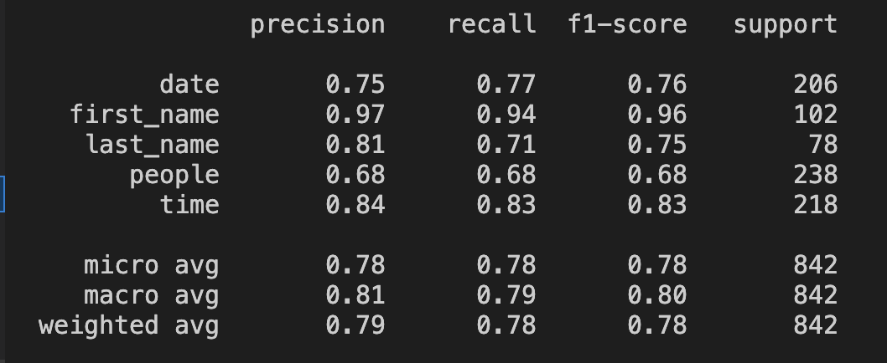

# HW1

## Q1: Data processing (2%)

1. Describe how do you use the data for intent_cls.sh, slot_tag.sh:
   - How do you tokenize the data.
   - The pre-trained embedding you used.

note:

If you use the sample code, you will need to explain what it does in
your own ways to answer Q1.

### how I process the data in each script

Since I'm using the sample code to preprocess the data, I'm just explaining how it works

First, we should list how many data we can use in this project.

1. glove.804B.300d.text
2. eval.json, test.json, train.json for each one

The first case is a pre-trained embedding that converts words to 300 dim vertices

The second case is data that can be used to train, evaluate, test my model

Second, we need to process data before using them in the model

Here are the things to do in order

1. Get all words used in eval.json and train.json, these are the goals we need to put in pre-trained embedding
2. Create a objects that includes each type of target and its idx, which will be used to convert the model's output to the real target or encode target to matrix
3. By taking out only the text to be used and shrinking the glove model, it is convenient to reduce the memory occupied by the model

Finally, we can get three things to train the model

1. {\*target}2idx
2. vocab.pkl
3. embedding.pt

The first two are used to encode and decode string
The third item is put into the model to complete the word embedding

## Q2: Describe your intent classification model. (2%)

1. Describe
   - your model
   - performance of your model.(public score on kaggle)
   - the loss function you used.
   - The optimization algorithm (e.g. Adam), learning rate and batch size

### describe my model

To explain my model, i consider put the pseudo code for it is the best idea

```python
class SeqClassifier(torch.nn.Module):
    def __init__() -> None:
        super(SeqClassifier, self).__init__()
        self.embed = Embedding.from_pretrained(word_embedding_model)
        self.rnn = RNN(some_parameters)
        self.linear = Linear(some_parameters)

    def forward(self, batch) -> Dict[str, torch.Tensor]:
        embed_out = self.embed(data_from_batch)
        rnn_out, _ = self.rnn(embed_out)
				# use word average algo to decrease 1 dim for matrix
        encode_out = torch.mean(rnn_out, 1)
        final_out = self.linear(encode_out)
        return final_out
```

As above, the structure for my model is :

1. input matrix(batch size \* string length) ⇒ word embedding model ⇒ embedding matrix
2. embedding matrix(batch size _ string length _ word vector length) ⇒ RNN ⇒ a three dim matrix
3. three dim matrix(batch size _ string length _ hidden size) ⇒ word average ⇒ a two dim matrix
4. two dim matrix(batch size \* hidden size) ⇒ linear layer ⇒ output matrix
5. output matrix(batch size \* target type count)

<aside>
💡 The size of the upper hidden size should be multiplied by two when it is bidirectional

</aside>

the public score for my model is **0.90711**

Also, **CrossEntropyLoss** is the loss function I used when training this model

Finally, i will list some important information for this model

1. optimization algorithm : Adam
2. learning rate: I used 0.001 at first, but I also used the scheduler, and every time when the correct rate decreased, the learning rate was reduced by half
3. batch size : 64

## Q3: Describe your slot tagging model. (2%)

1. Describe
   - your model
   - performance of your model.(public score on kaggle)
   - the loss function you used.
   - The optimization algorithm (e.g. Adam), learning rate and batch size

### describe my model

To explain my model, i consider put the pseudo code for it is the best idea

```python
class SlotModel(torch.nn.Module):
    def __init__() -> None:
        super(SlotModel, self).__init__()
        self.embed = Embedding.from_pretrained(word_embedding_model)
        self.rnn = RNN(some_parameters)
        self.linear = Linear(some_parameters)

    def forward(self, batch, IS_MPS=False) -> Dict[str, torch.Tensor]:
        data = data_from_batch
        embed_out = self.embed(data)
        rnn_out, _ = self.rnn(embed_out)
        final_out = self.linear(rnn_out)
        return final_out
```

As above, the structure for my model is :

1. input matrix(batch size \* string length) ⇒ word embedding model ⇒ embedding matrix
2. embedding matrix(batch size _ string length _ word vector length) ⇒ RNN ⇒ a three dim matrix
3. three dim matrix(batch size _ string length _ hidden size) ⇒ linear layer ⇒ output matrix
4. output matrix(batch size _ string length _ target type count)

<aside>
💡 The size of the upper hidden size should be multiplied by two when it is bidirectional

</aside>

the public score for my model is **0.78230**

Also, **BCEWithLogitsLoss** is the loss function I used when training this model

Finally, i will list some important information for this model

1. optimization algorithm : Adam
2. learning rate: I used 0.001 at first, but I also used the scheduler, and every time when the correct rate decreased, the learning rate was reduced by half
3. batch size : 64

## Q4: Sequence Tagging Evaluation (2%)

- Please use seqeval to evaluate your model in Q3 on validation set and report classification_report(scheme=IOB2, mode=’strict’).
- Explain the differences between the evaluation method in seqeval, token accuracy, and joint accuracy.

### report of seqeval

classification_report(scheme=IOB2, mode=’strict’)



### the different between default mode and strict mode

just like the sample in seqeval document

```python
>>> from seqeval.metrics import classification_report
>>> from seqeval.scheme import IOB2
>>> y_true = [['B-NP', 'I-NP', 'O']]
>>> y_pred = [['I-NP', 'I-NP', 'O']]
>>> classification_report(y_true, y_pred)
              precision    recall  f1-score   support
          NP       1.00      1.00      1.00         1
   micro avg       1.00      1.00      1.00         1
   macro avg       1.00      1.00      1.00         1
weighted avg       1.00      1.00      1.00         1
>>> classification_report(y_true, y_pred, mode='strict', scheme=IOB2)
              precision    recall  f1-score   support
          NP       0.00      0.00      0.00         1
   micro avg       0.00      0.00      0.00         1
   macro avg       0.00      0.00      0.00         1
weighted avg       0.00      0.00      0.00         1
```

Strict mode requires all the words in the sentence to be correct, and the default mode is a little wrong.

## Q5: Compare with different configurations (1% + Bonus 1%)

- Please try to improve your baseline method (in Q2 or Q3) with different configuration (includes but not limited to different number of layers, hidden dimension, GRU/LSTM/RNN) and EXPLAIN how does this affects your performance / speed of convergence / ...
- Some possible BONUS tricks that you can try: multi-tasking, few-shot learning, zero-shot learning, CRF, CNN-BiLSTM
- This question will be grade by the completeness of your experiments and your findings.

### how to improve the accuracy for my model

In this part, I will discuss my experience improving my baseline for Q3 with different configurations.

For the first time, all model configurations in the code are default for sample code, I use CrossEntropyLoss as loss function.

However, I found the accuracy is only about 10%, so i check some document in web

It has been said that when the NLP dataset is small, a too large batch size may reduce the accuracy of the results, because padding may introduce some noise to the model, and padding of small batch size will generate less noise than it. However, we cannot reduce the batch size indefinitely, because larger batch sizes lead to higher accuracy results in many experiences

As below, I tried batch size 32 and 64, I found that when batch size is 64, we can have almost 60% accuracy, but when batch size is 32, it only has about 20% accuracy, so I set batch size to 64 finally.

Since the accuracy has not surpassed the baseline, I tried to increase the number of layers in the RNN, as more layers can describe more complex situations, I tried 3 and 4 layers, and I found that 3 layers can get about 70% accuracy Accuracy, but 4 layers may be the gradient vanishing only 1% accuracy, I ended up setting the number of layers to 4.

Then I found a special case in the model at the time, when the loss decreased, the accuracy did not increase at the same time. I guess it was because I chose the wrong loss function, it didn't achieve the optimal goal in this case, so I changed the loss function to BCEWithLogitsLoss, many docs on the web say that in this case this function will be very Good performance, after I changed this loss function, I got about 78% accuracy, I finally got the model that can beat the baseline

<aside>
💡 I also tried to use BiLSTM, but I think because it doesn't have CNN, it can't extract the focus, so the model can't converge in the end

</aside>
